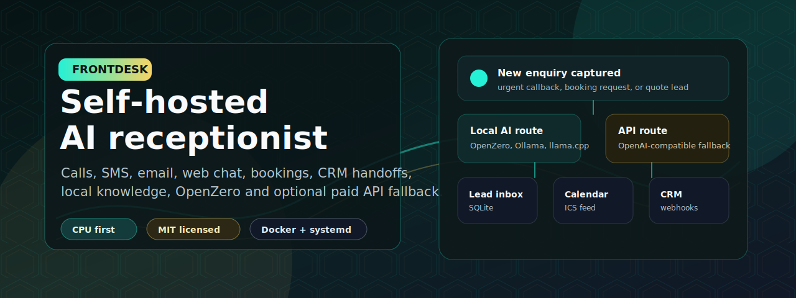
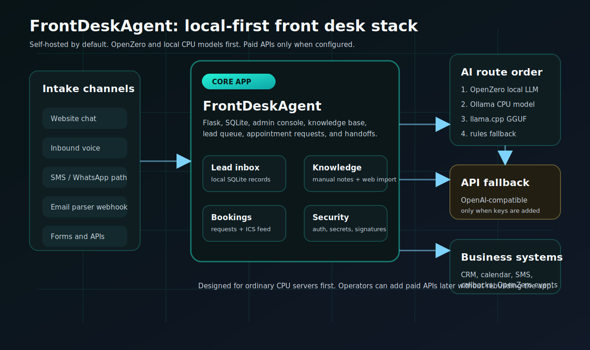

# FrontDeskAgent



[](pyproject.toml)
[](LICENSE)
[](docs/AI_ROUTING.md)
[](docs/OPENZERO_INTEGRATION.md)

FrontDeskAgent is a self-hosted AI receptionist and front desk console for small businesses, clinics, trades, education teams, hotels, agencies, and any organisation that needs enquiries captured reliably.

It is built for ordinary CPU servers first: Flask, SQLite, simple templates, local knowledge, local model routes, and a no-model fallback. OpenZero, Ollama, and llama.cpp are first-class routes. Hosted OpenAI-compatible APIs are optional secondary fallbacks when an operator deliberately adds API keys.

Public site: https://frontdeskagent.online/

Companion playbooks: https://github.com/ResearchForumOnline/FrontDeskAgent-Playbooks

## Featured Ecosystem Video

[](https://www.youtube.com/watch?v=R52hsRdCmSM)

Watch how the wider TalkToAI stack fits together: ZeroThink, OpenZero, local-first AI infrastructure, and practical self-hosted products such as FrontDeskAgent.

## What It Gives You

- Local lead inbox for web chat, forms, SMS, email, and phone intake events.
- Industry-aware intake flows for trades, clinics, admissions, hotels, property, agencies, and general front desks.
- Knowledge base for opening hours, service areas, prices, policies, escalation rules, and imported website text.
- AI replies through `auto`, OpenZero, Ollama, llama.cpp, any OpenAI-compatible endpoint, or the built-in rules fallback.
- Appointment request logging plus a token-protected `.ics` calendar feed.
- Twilio-compatible voice webhook that captures caller speech and creates a lead.
- Twilio SMS webhook plus generic JSON SMS and email intake webhooks.
- Outbound SMS through Twilio, Telnyx, or any custom webhook.
- Outbound callback trigger through Twilio or a custom webhook.
- Optional Voicebox local voice output for staff alerts and agent speech.
- Optional CallChat integration path so the same OpenZero and Voicebox stack can power a Matrix room agent.
- SMTP staff handoff emails.
- CRM, booking, n8n, Zapier, Make, and internal API webhooks.
- OpenZero event bridge and `/api/openzero/context` for local agent supervision.
- Admin auth, webhook shared secrets, optional Twilio signature verification, Docker, systemd, and a beginner setup wizard.

## Local-First AI Routing

Fresh installs use:

```env
LLM_BACKEND=auto
```

`auto` mode tries the practical self-hosted routes before touching a hosted API:

1. OpenZero local LLM bridge: `OPENZERO_LLM_URL`
2. Ollama CPU model: `OLLAMA_URL` and `OLLAMA_MODEL`
3. llama.cpp GGUF server: `LLAMACPP_URL`
4. OpenAI-compatible hosted/API fallback, only when `OPENAI_COMPAT_URL` and `OPENAI_COMPAT_MODEL` are configured
5. Built-in rules fallback, so the app still answers before a model is installed



Recommended CPU starter model:

```bash
ollama serve
ollama pull qwen2.5:3b
```

Optional hosted OpenAI-compatible fallback:

```env
OPENAI_COMPAT_URL=https://api.openai.com/v1/chat/completions
OPENAI_COMPAT_API_KEY=sk-your-key
OPENAI_COMPAT_MODEL=gpt-5.5
```

Keep paid providers optional. The app is designed to keep running locally without them.

## Open-Source Voice With Voicebox

FrontDeskAgent now supports Voicebox as an optional local voice output backend. Voicebox is a local-first open-source voice stack in the same product category as cloud voice tools, but it runs on your own machine and exposes a simple REST API.

Use it for staff alerts, agent speech, demos, front-desk desk-side announcements, and OpenZero-supervised workflows:

```env
VOICE_TTS_PROVIDER=voicebox
VOICEBOX_URL=http://127.0.0.1:17493
VOICEBOX_ENDPOINT=/generate
VOICEBOX_PROFILE=your-profile-id
VOICEBOX_LANGUAGE=en
VOICEBOX_ALERT_ON_LEAD=true
```

Then test:

```bash
curl -X POST http://localhost:8088/api/voice/speak \
  -H "Content-Type: application/json" \
  -H "X-FrontDeskAgent-Secret: your-shared-secret" \
  -d '{"text":"FrontDeskAgent voice test complete.","profile_id":"your-profile-id"}'
```

Phone calls still use Twilio or a custom call webhook for carrier connectivity. Voicebox gives the self-hosted app a local open-source voice layer without making speech output depend on a paid cloud voice provider. By default, FrontDeskAgent calls Voicebox `POST /generate` with `text`, `profile_id`, and `language`.

## Quick Start

```bash
git clone https://github.com/ResearchForumOnline/FrontDeskAgent.git
cd FrontDeskAgent
python3 -m venv .venv
source .venv/bin/activate
pip install -r requirements.txt
python -m frontdeskagent.setup_wizard
python -m frontdeskagent.app
```

Open:

```text
http://localhost:8088
```

## One-Line Server Install

Review before running:

```bash
curl -fsSL https://raw.githubusercontent.com/ResearchForumOnline/FrontDeskAgent/main/install.sh -o install-frontdeskagent.sh
less install-frontdeskagent.sh
bash install-frontdeskagent.sh
```

## Downloads And Releases

| Need | Link |
| --- | --- |
| Latest GitHub source archive | [Download ZIP](https://github.com/ResearchForumOnline/FrontDeskAgent/archive/refs/heads/main.zip) |
| GitHub releases | [FrontDeskAgent releases](https://github.com/ResearchForumOnline/FrontDeskAgent/releases) |
| One-line install script | [install.sh](install.sh) |
| Deployment guide | [docs/DEPLOYMENT.md](docs/DEPLOYMENT.md) |
| OpenZero integration | [docs/OPENZERO_INTEGRATION.md](docs/OPENZERO_INTEGRATION.md) |
| CallChat integration | [docs/CALLCHAT_INTEGRATION.md](docs/CALLCHAT_INTEGRATION.md) |
| Industry playbooks | [ResearchForumOnline/FrontDeskAgent-Playbooks](https://github.com/ResearchForumOnline/FrontDeskAgent-Playbooks) |

FrontDeskAgent is written for people searching for a self-hosted AI receptionist, local AI phone agent, AI front desk, open-source call intake system, local-first business chatbot, Twilio voice webhook receptionist, Ollama receptionist, and OpenZero-powered customer intake agent.

## Pages In The App

- Dashboard: live counts, recent leads, integration status, model status, and activity.
- Playground: test the receptionist and save manual leads.
- Leads: review enquiries, urgency, source, contact details, and trigger callbacks.
- Appointments: create appointment requests and publish the optional calendar feed.
- Knowledge: add manual notes or import public website pages.
- Integrations: copy webhook URLs for Twilio, SMS, email, CRM, booking, calendar, and OpenZero.
- Settings: verify configured model, security, SMS, CRM, and deployment options.

## OpenZero Integration

FrontDeskAgent can publish lead, booking, handoff, and health events to OpenZero:

```env
OPENZERO_WEBHOOK_URL=http://127.0.0.1:1024/api/frontdeskagent/event
OPENZERO_API_KEY=
```

It can also use OpenZero as the first LLM bridge in `auto` mode:

```env
LLM_BACKEND=auto
OPENZERO_LLM_URL=http://127.0.0.1:1024/v1/chat/completions
OPENZERO_MODEL=local
```

See [docs/OPENZERO_INTEGRATION.md](docs/OPENZERO_INTEGRATION.md).

## CallChat Integration

The same OpenZero and Voicebox services can also power a CallChat Matrix room agent such as `@zero:callchat.org`. This lets a business run local AI reception workflows and secure Matrix room assistance from one self-hosted stack.

See [docs/CALLCHAT_INTEGRATION.md](docs/CALLCHAT_INTEGRATION.md).

## Docs

- [AI routing](docs/AI_ROUTING.md)
- [Downloads and releases](docs/DOWNLOADS_AND_RELEASES.md)
- [Deployment](docs/DEPLOYMENT.md)
- [CPU models](docs/CPU_MODELS.md)
- [Integrations](docs/INTEGRATIONS.md)
- [API and webhooks](docs/API.md)
- [CallChat integration](docs/CALLCHAT_INTEGRATION.md)
- [Industry playbooks](docs/INDUSTRY_PLAYBOOKS.md)
- [Security guide](docs/SECURITY.md)
- [Self-hosted business guide](docs/SELF_HOSTED_BUSINESS_GUIDE.md)
- [Roadmap](docs/ROADMAP.md)
- [Changelog](CHANGELOG.md)

## Repository Boundary

This repository is the open-source self-hosted app. It does not include production phone numbers, live credentials, private customer data, voice-clone data, hosted service secrets, or model weights.

Keep `.env`, SQLite runtime databases, uploads, transcripts, call recordings, and private customer data out of Git.

## License

MIT License. See [LICENSE](LICENSE).
